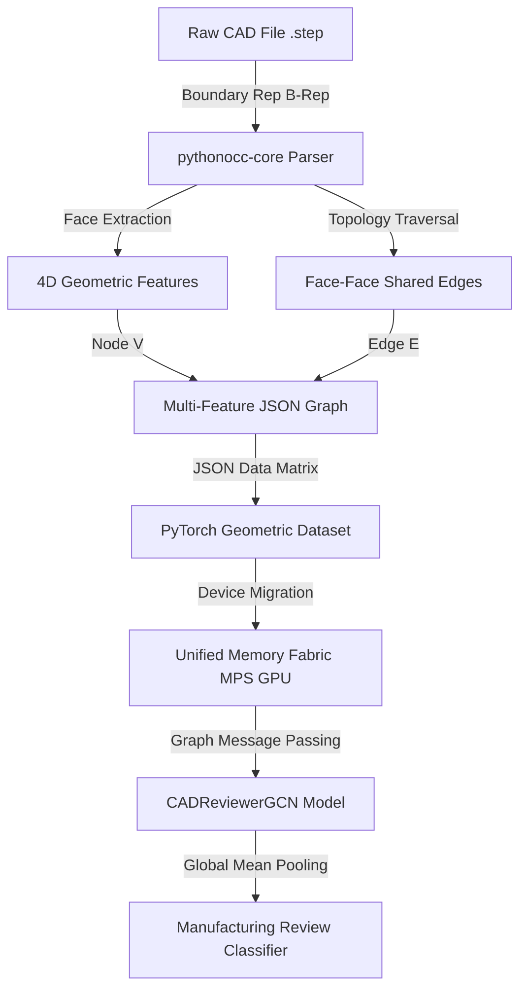

# 📐 AI CAD Reviewer

[](https://developer.apple.com/metal/pytorch/)
[](https://pytorch-geometric.readthedocs.io/)
[](https://github.com/tpaviot/pythonocc-core)

A high-performance, geometric deep learning pipeline running natively on Apple Silicon. This project converts raw 3D CAD Boundary Representation (B-Rep) models (via `.step` files) into graph representations and leverages Graph Neural Networks (GNNs) for manufacturing review and design validation.

---

## 🗺️ Pipeline Architecture

This pipeline parses 3D mechanical CAD geometry directly from engineering formats, transforms topological relationships into graph matrices, loads them as graph tensors, and trains a GCN model accelerated by macOS Metal Performance Shaders (MPS).



---

## 🛠️ Key Technical Features

### 1. B-Rep Geometry & Feature Engineering
Rather than voxelizing or rendering CAD shapes to 2D images (which destroys crucial topological metrics), we query the Boundary Representation (B-Rep) structure using the **Open Cascade** kernel:
*   **Surface Area**: Calculated through real integration via `brepgprop.SurfaceProperties`.
*   **Surface Type Classification**: Map face curvatures into continuous indices (0.0: Plane, 1.0: Cylinder, 2.0: Freeform Splines/Cones/Spheres) via `BRepAdaptor_Surface`.
*   **Center of Mass (COM)**: Captures 3D spatial orientation coordinates ($x, y, z$).
*   **Aspect Ratio & Thickness**: Volume computations of bounding boxes around individual faces utilizing `Bnd_Box` and `brepbndlib`.

### 2. Topological Graph Construction
*   Extracts face adjacency topology based on shared physical boundary edges.
*   Resolves shared boundary linkages using `TopTools_IndexedDataMapOfShapeListOfShape` and `topexp.MapShapesAndAncestors`.
*   Connects nodes (faces) only where exactly two faces meet at a shared edge, avoiding floating geometries or open hulls.

### 3. Apple Silicon Optimized Training
*   Tensors are structured into bidirectional coordinate list (COO) directed edge indexes of shape `[2, 2 * Num_Links]` using a custom **PyTorch Geometric (PyG)** loader.
*   Natively shifts models and dataset instances to **Metal Performance Shaders** (`torch.device("mps")`), leveraging the unified memory architecture for zero-copy CPU-GPU processing.

---

## 📂 Codebase Directory Structure

```directory
cad-reviewer-ai/
├── main.py                 # Core STEP file parser & 4D feature JSON extractor
├── dataset_loader.py       # Custom PyG Dataset Loader mapping topologies to tensors
├── cad_gnn_model.py       # 2-layer Graph Convolutional Network (GCNConv) classifier
├── train.py                # Gradient optimization loop targeting local Apple Silicon (MPS)
├── cad_graph_dataset.json  # Raw extracted topological node-link graph database
└── data_chunks/            # CAD storage partition
    └── abc_0000_step_v00/  # Subset of step engineering models (ABC Dataset)
```

---

## ⚙️ Environment Setup & Installation

This project is optimized for macOS running on **Apple Silicon (M-series)** with python-occ and PyTorch.

### 1. Conda Environment Initialisation
Create and activate a Python 3.10 environment using `conda-forge`:

```bash
conda create -n cad-ai python=3.10 -c conda-forge
conda activate cad-ai
```

### 2. Dependency Installation
Install PyTorch (with MPS support), PyTorch Geometric dependencies, and `pythonocc-core`:

```bash
# Install PyTorch
conda install pytorch torchvision torchaudio -c pytorch

# Install PyTorch Geometric
pip install torch_geometric

# Install Open Cascade bindings
conda install -c conda-forge pythonocc-core
```

### 3. Resolving Multi-threading Collisions
> [!IMPORTANT]
> If Open Cascade (`libomp.dylib`) and PyTorch OpenMP libraries conflict, you will encounter runtime crashes during training. Permanently resolve this collision by injecting the runtime bypass configuration into your environment profile:
> ```bash
> echo 'export KMP_DUPLICATE_LIB_OK=TRUE' >> ~/.zshrc
> source ~/.zshrc
> ```

---

## 🚀 Execution & Usage Guide

Follow these sequential steps to run the pipeline:

### 1. Extract 4D Features from Raw CAD Step Files
Execute `main.py` to parse up to 100 `.step` files and compile the JSON graph database.
```bash
python main.py
```
*   **Input**: `data_chunks/abc_0000_step_v00/*.step`
*   **Output**: `cad_graph_dataset.json`

### 2. Validate Tensor Transformation
Verify the custom loader maps geometric graphs to PyTorch Geometric tensors:
```bash
python dataset_loader.py
```
Expected output:
```text
📚 Loaded PyTorch Geometric Dataset with 100 enriched CAD graphs.
📊 New Tensor X (Nodes, Features) Shape: torch.Size([N, 4]) <-- Expecting 4 features!
```

### 3. Run GNN Classifier Training
Train the Graph Convolutional Network natively on your GPU:
```bash
python train.py
```
*   Runs backpropagation across 20 epochs.
*   Categorizes parts using dynamic complexity labels derived from topological graph density.
*   Achieves model convergence with average graph loss reducing from `~33.57` to `~13.25`.

---

## 📈 Optimization Roadmap & Next Steps

To advance this pipeline from topological validation to manufacturing-grade reviews:

1.  **True Manufacturing Constraints**: Move away from synthetic geometric complexity labels. Integrate actual defect conditions (e.g., detecting thin walls, collision interferences, deep blind pockets, or steep overhangs).
2.  **Generalization Auditing**: Refactor `train.py` to use a validation/test split (e.g. 80/20 train/validation) utilizing mini-batching (`torch_geometric.loader.DataLoader`) to calculate actual generalization metrics.
3.  **Data Scale-Up**: Expand extraction pipeline across the complete ABC Dataset chunk of 10,000 files to build robust neural embeddings.
